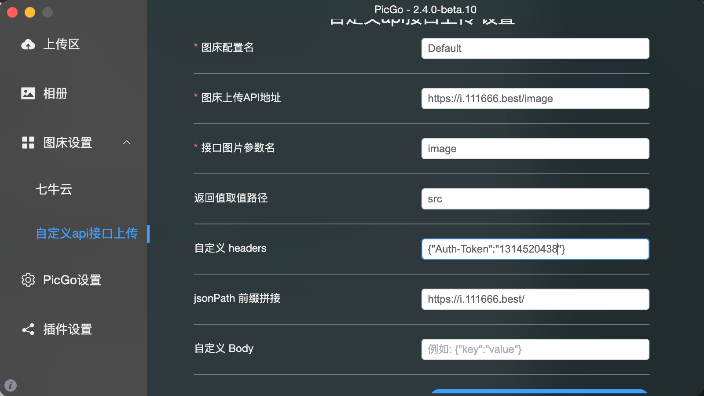

# picgo-plugin-custom-api-uploader

picog 插件, 可以自定义 api 接口上传图片

## 安装

### 方式一(推荐)

打开 [PicGo](https://github.com/Molunerfinn/PicGo) 详细窗口, 选择插件设置, 搜索 `custom-api-uploader` 安装, 然后重启应用即可。

### 方式二(推荐)

下载压缩包, 解压到桌面, 然后打开 PicGo 详细窗口, 选择插件设置, 选择 `安装本地插件`, 选择解压的文件夹, 然后重启应用即可。

### 方式三

克隆该项目，复制项目到以下目录：

Windows: `%APPDATA%\picgo\`
Linux: `$XDG_CONFIG_HOME/picgo/` or `~/.config/picgo/`
macOS: `~/Library/Application\ Support/picgo/`

切换到新目录执行 `npm install ./picgo-plugin-custom-api-uploader`, 然后重启应用即可。

## 配置

| 配置项 | 说明 | 必填 |
| --- | --- | --- |
| url | 图床上传API地址 | 是 |
| paramName | 上传图片参数名 | 是 |
| jsonPath | 返回值取值路径 (eg: `data.url`) | 否 |
| customHeader | 自定义 headers 严格 JSON 格式 (eg: `{"key":"value"}`) | 否 |
| customBody | 自定义 Body 严格 JSON 格式 (eg: `{"key":"value"}`) | 否 |
| prefix | `jsonPath` 返回值前缀拼接 | 否 |

## 图床示例

### 16 图床

[16 图床网页上传](https://16.pics)

| 配置项 | 值 |
| --- | --- |
| 图床配置名 | Default |
| API地址 | https://i.111666.best/image |
| 接口图片参数名 | image |
| 返回值取值路径 | src |
| 自定义 headers | {"Auth-Token":"改成你自己的唯一值"} |
| jsonPath 返回值前缀拼接 | https://i.111666.best/ |

## 相关项目

- [PicGo](https://github.com/Molunerfinn/PicGo) - 🚀A simple & beautiful tool for pictures uploading built by vue-cli-electron-builder